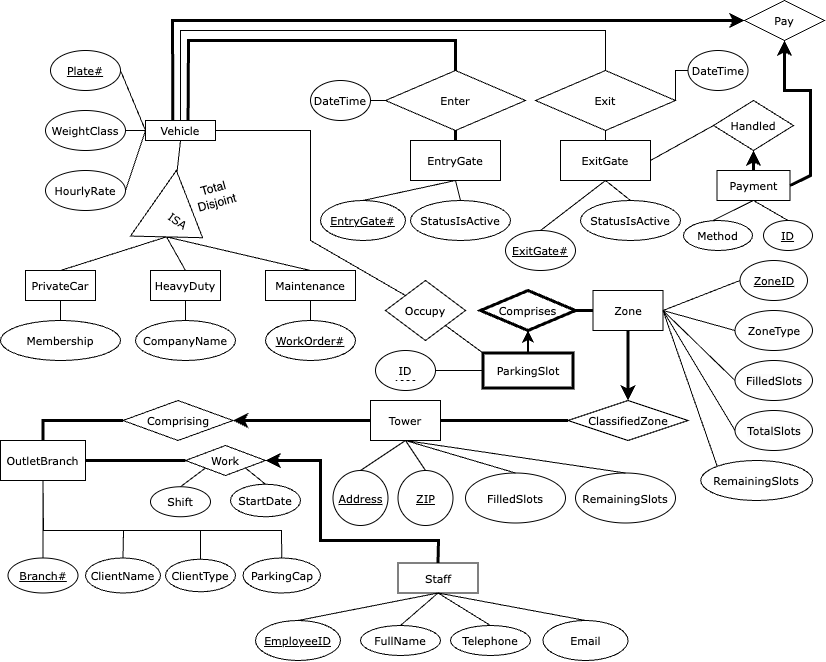

# Car Parking Management System

A repository for CPSC 304: Introduction to Relational Databases by the University of British Columbia. Our objective was design a database with an interactive GUI application.

---

## Group Members and Student Numbers

- (13046024) Dwayne Dmello
- (67719955) Theo Obadiah Teguh
- (49330046) Adeeb Khan

---

## General Description

This project involves the development of a database system tailored for multi-level car parks. This application is designed to streamline the management of parking facilities, providing a solution for overseeing operations, assessing profitability, and analyzing car distribution within a network of parking lots. The primary goal is to enhance efficiency and user experience in parking lots while addressing common challenges such as finding parking spaces in crowded areas, locating parked cars, and planning ahead for reservations.

---

## Database Overview

Our database can explained with the following Entity Relationship Diagram. Please note that the following figure has been **reviewed and updated** over the first two project milestones.

---

## Project Timeline

- 16th March: Plan out exact functionality and rough frontend design.
- 17th March: Start programming frontend with React.js, start designing database queries.
- 23rd March: Have frontend ready, have the database set up and hosted, with queries for all functionalities ready. Crosscheck work to ensure compatibility.
- 24th March: Start developing the Express.js API to link the frontend and backend.
- 31st March: Finish developing API. Have all endpoints tested in postman and well commented for use in frontend. Start calling API from frontend and completing the linking.
- 2nd April: Finish linking the frontend and backend, iron out any last minute bugs or discrepancies.
- 3rd April to 5th April: Ask for feedback in office hours and from TA to improve project and make final changes.
- 5th April: Submit project by 6pm or sooner.

## Change Log

- Added TowerID as primary key for Towers and removed Address and Zip as Primary Keys.

